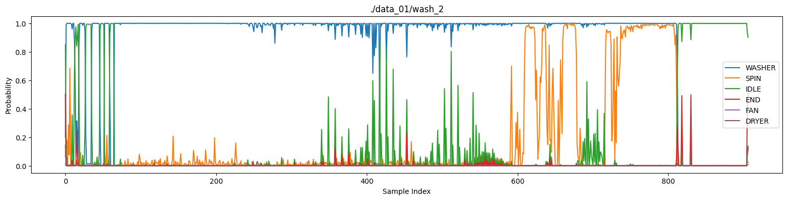

# Washer cycle classifier

Real-time and offline tooling for classifying spectrograms of household equipment audio, training the classifiers, and streaming predictions to downstream services over MQTT.

## Why?

My washer and dryer is not smart, but I want to know when it's done and get a push notice when it becomes idle after a wash cycle. That requires some kind of sensor, and to that end I've tried electricity meters (ok success) and vibration sensors (low success).

A cnn classifier that can classify multiple devices and differentiate between steps in the cycle would be even better.

## Hardware

A simple €10 USB microphone, and a NanoPi with 1Gb ram.

## Data

Recorded cycles, idle ambiance and random activity to sound files. Labeling in [https://labelstud.io/](label-studio).

## Network design

Before landing in the 2d spectrum classifier a 1d version was evaluated. The spectrum analyzer had better result in mixed conditions, at a lower resource usage. Accuracy increased again when using a resnet design.

To save memory and compute, the spectrum is halved in resolution before passing though the classifier. Future development will try to get the same result with a 1/4 resolution that takes more accurate averages of the spectrum before classification.

As of writing, the network contains about 4.3m parameters, which is a wonderful overkill for it's purpose.

## Results

Graph of classification over an entire cycle.


The "END" label is a small beep that is periodically emitted after cycle end. This has the potential to be a very good signal to the classifier, but more data is needed to train on it properly.

---

## 1. Prerequisites

- Python 3.10+
- Recommended: virtual environment with `pip install -r requirements.txt` (torch, torchvision, sounddevice, librosa, scipy, pillow).
- macOS audio input with sounddevice-compatible drivers.

Set the Python environment:

```bash
python -m venv .venv
source .venv/bin/activate
pip install -r requirements.txt
```

---

## 2. Exporting annotations from Label Studio

1. In Label Studio choose **Export → JSON-MIN**.
2. Save the export as `annotations/annotations.json` (default the training script expects).
3. Each entry’s `audio` field should include the original `.m4a` name; the trainer matches spectrogram prefixes against this suffix.

To override the file path later, pass `--annotations-file /path/to/export.json` when training.

---

## 3. Generating spectrogram samples

Convert raw `.m4a` recordings into 10-second grayscale spectrogram PNGs:

```bash
python sample_create.py audio/machine_sounds.m4a data_01/machine_sounds
```

The script slices audio into 44.1 kHz mono blocks and creates files named `<audio_stem>_<seconds>.png`. Those filenames drive the annotation lookup during training.

---

## 4. Training the classifier

Train a residual CNN that predicts `WASHER`, `DRYER`, `SPIN`, `IDLE`, `END`, `FAN` labels (multi-label, sigmoid outputs):

```bash
python train.py \
	--data-dir data_01 \
	--annotations-file annotations/annotations.json \
	--epochs 15 \
	--batch-size 16 \
	--img-size 171 286 \
	--output models/train.pt
```

Helpful flags:

- `--val-split` (default 0.2) to change validation ratio.
- `--seed` for reproducible shuffles.
- `--num-workers` to tune dataloader throughput.

The checkpoint saves class metadata alongside weights so evaluators and monitors can resolve label order.

---

## 5. Running ad-hoc evaluation on a PNG

```bash
python evaluate.py \
	--model models/audioclass.pt \
	--spectrogram data_01/end1_690.png
```

Sample output:

```
WASHER      : 0.9423
SPIN        : 0.1035
IDLE        : 0.0112
END         : 0.0021
DRYER:      : 0.1231
FAN         : 0.0004
```

Use the `--device` flag to force `cpu|cuda|mps` if needed.

---

## 6. Monitoring live audio and streaming probabilities

`monitor_torch.py` and `monitor_onnx.py` mirror the capture loop in `record.py`, but feed each 10-second spectrogram directly into the trained model and publish JSON payloads to an MQTT topic (one message per window).

### Publish with a PyTorch checkpoint

```bash
python monitor_torch.py \
	--model models/audioclass.pt \
	--mqtt-topic appliances/wash1 \
	--mqtt-host localhost \
	--device-index 0 \
	--device mps
```

### Publish with an ONNX runtime (lightweight / Pi)

```bash
python monitor_onnx.py \
	--onnx-model models/audioclass.onnx \
	--mqtt-topic appliances/wash1 \
	--mqtt-host 192.168.1.50 \
	--device-index 1
```

Each run prints the per-class probabilities and also sends a JSON document like the following to the requested topic:

```json
{
  "timestamp": "2025-12-05T13:44:48.082Z",
  "probabilities": {
    "WASHER": 0.463,
    "SPIN": 0.658,
    "IDLE": 0.607,
    "END": 0.331,
    "FAN": 0.104,
    "DRYER": 0.1536
  }
}
```

---

## 7. Optional: recording raw spectrograms

`record.py` captures live spectrograms to disk every 10 seconds and optionally writes tag files (`--tags washer,idle`). Use this for manual verification of audio capture quality.

---

## 8. Troubleshooting

- **Audio device index**: run `python -m sounddevice` to list inputs and pass the correct `--device-index` to `record.py`/`monitor_torch.py`/`monitor_onnx.py`.
- **Missing libraries**: ensure `brew install ffmpeg` so librosa can decode `.m4a` sources.
- **MQTT connectivity**: confirm your broker is reachable from the capture host; both monitor scripts log a warning any time `publish()` fails.

---

## 9. Deploying on Raspberry Pi / other edge devices

1. **Train on your workstation** (PyTorch) and export the model to ONNX:

   ```bash
   python export_onnx.py \
      --checkpoint models/conv2d_model.pt \
      --output export/conv2d_model.onnx \
   ```

2. **Copy runtime artifacts** to the Pi: `monitor_onnx.py`, `conv2d_model.py`, the exported `.onnx` file (and `.meta.json`), plus `requirements.min.txt`.

3. **Install the lightweight dependencies** on the Pi (no desktop PyTorch needed):

   ```bash
   python -m venv .venv
   source .venv/bin/activate
   pip install -r requirements.min.txt
   ```

4. **Run the ONNX-only monitor** (see section 6). Everything stays CPU-only and uses `onnxruntime` for inference, which fits well on Raspberry Pi hardware.

## 10. Running as docker container

1. **Build the docker image** `make docker` builds and outputs an image to `docker/`
1. **Load the docker image on host** `docker load -i image.tar`
1. **Start the container**

```
docker run \
    --device /dev/snd/ \
    --group-add audio \
    -e MONITOR_MQTT_HOST=<your host> \
    -e MONITOR_MQTT_TOPIC=washer \
    dhogborg/washer:latest
```

## 11. Debug monitor in container

Create a folder named `debug/` and the script will write the spectrum data there. Transfer the image out of the container with `docker cp <container>:/app/debug/spectrum_debug.png ~`
